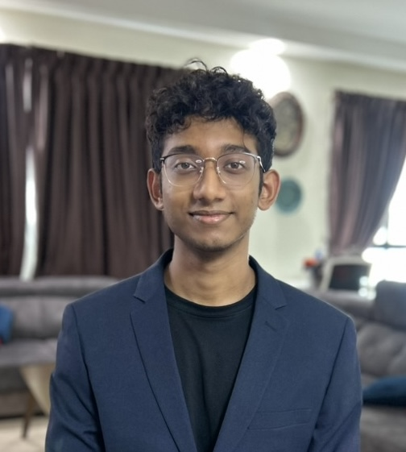
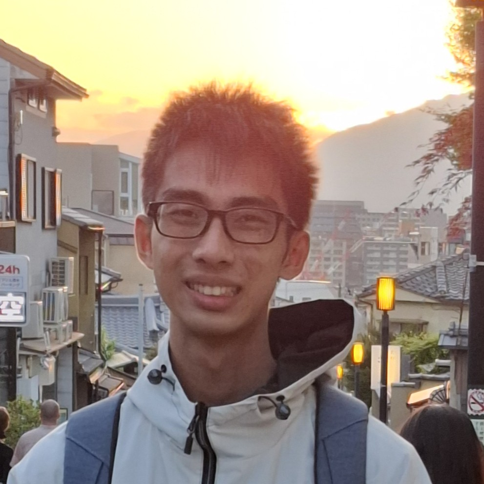
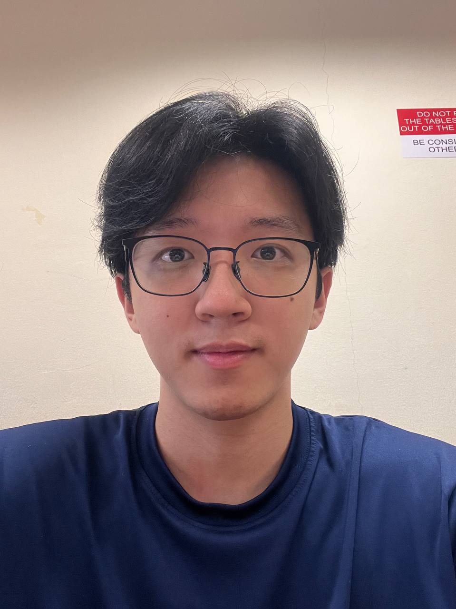

We are a team based in the [School of Computing, National University of Singapore](https://www.comp.nus.edu.sg).

## Project team

### Nihaal Manaf

[[github](http://github.com/nihaalmanaf)] [[portfolio](team/nihaalmanaf.md)]

- Role: Team Lead
- Responsibilities: DevOps + Leading

### Poh Anson

[[github](http://github.com/pohanson)]

- Role: Developer
- Responsibilities: Storage

### Sean Richardson Hardjanto

[[github](http://github.com/seanrh34)]

- Role: Developer
- Responsibilities: UI, Logic, and Model

### Zhao Ruixuan

[[github](http://github.com/rotarykirby)]

- Role: Developer
- Responsibilities: UI, Logic, and Model
