* Table of Contents
{:toc}

--------------------------------------------------------------------------------------------------------------------

## **Acknowledgements**

* {list here sources of all reused/adapted ideas, code, documentation, and third-party libraries -- include links to the original source as well}

--------------------------------------------------------------------------------------------------------------------

## **Setting up, getting started**

Refer to the guide [_Setting up and getting started_](SettingUp.md).

--------------------------------------------------------------------------------------------------------------------

## **Design**

<div markdown="span" class="alert alert-primary">

:bulb: **Tip:** The `.puml` files used to create diagrams are in this document `docs/diagrams` folder. Refer to the [_PlantUML Tutorial_ at se-edu/guides](https://se-education.org/guides/tutorials/plantUml.html) to learn how to create and edit diagrams.
</div>

### Architecture


The ***Architecture Diagram*** given above explains the high-level design of the App.

Given below is a quick overview of main components and how they interact with each other.

**Main components of the architecture**

**`Main`** (consisting of classes [`Main`](https://github.com/AY2526S1-CS2103T-T08-2/tp/tree/master/src/main/java/seedu/address/Main.java) and [`MainApp`](https://github.com/AY2526S1-CS2103T-T08-2/tp/tree/master/src/main/java/seedu/address/MainApp.java)) is in charge of the app launch and shut down.
* At app launch, it initializes the other components in the correct sequence, and connects them up with each other.
* At shut down, it shuts down the other components and invokes cleanup methods where necessary.

The bulk of the app's work is done by the following four components:

* [**`UI`**](#ui-component): The UI of the App.
* [**`Logic`**](#logic-component): The command executor.
* [**`Model`**](#model-component): Holds the data of the App in memory.
* [**`Storage`**](#storage-component): Reads data from, and writes data to, the hard disk.

[**`Commons`**](#common-classes) represents a collection of classes used by multiple other components.

**How the architecture components interact with each other**

The *Sequence Diagram* below shows how the components interact with each other for the scenario where the user issues the command `delete 1`.


Each of the four main components (also shown in the diagram above),

* defines its *API* in an `interface` with the same name as the Component.
* implements its functionality using a concrete `{Component Name}Manager` class (which follows the corresponding API `interface` mentioned in the previous point.

For example, the `Logic` component defines its API in the `Logic.java` interface and implements its functionality using the `LogicManager.java` class which follows the `Logic` interface. Other components interact with a given component through its interface rather than the concrete class (reason: to prevent outside component's being coupled to the implementation of a component), as illustrated in the (partial) class diagram below.


The sections below give more details of each component.

### UI component

The **API** of this component is specified in [`Ui.java`](https://github.com/AY2526S1-CS2103T-T08-2/tp/tree/master/src/main/java/seedu/address/ui/Ui.java)

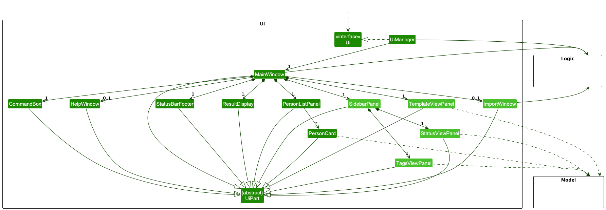

The UI consists of a `MainWindow` that is made up of parts e.g.`CommandBox`, `ResultDisplay`, `PersonListPanel`, `StatusBarFooter`, `SidebarPanel`, `TemplateViewPanel` etc. All these, including the `MainWindow`, inherit from the abstract `UiPart` class which captures the commonalities between classes that represent parts of the visible GUI.

**New UI Components in OnlySales:**
* `ImportWindow` - A separate window for importing customer data from clipboard
* `SidebarPanel` - A panel that contains the `StatusViewPanel` and `TagsViewPanel` for displaying active filters
* `StatusViewPanel` - Displays all currently active status filters applied through the find command
* `TagsViewPanel` - Displays all currently active tag filters applied through the find command  
* `TemplateViewPanel` - Displays and manages email templates for different customer status types

The `UI` component uses the JavaFx UI framework. The layout of these UI parts are defined in matching `.fxml` files that are in the `src/main/resources/view` folder. For example, the layout of the [`MainWindow`](https://github.com/AY2526S1-CS2103T-T08-2/tp/tree/master/src/main/java/seedu/address/ui/MainWindow.java) is specified in [`MainWindow.fxml`](https://github.com/AY2526S1-CS2103T-T08-2/tp/tree/master/src/main/resources/view/MainWindow.fxml)

The `UI` component,

* executes user commands using the `Logic` component.
* listens for changes to `Model` data so that the UI can be updated with the modified data.
* keeps a reference to the `Logic` component, because the `UI` relies on the `Logic` to execute commands.
* depends on some classes in the `Model` component, as it displays `Person` objects residing in the `Model`.
* The `SidebarPanel` contains nested UI components (`StatusViewPanel` and `TagsViewPanel`) that update automatically when filter commands are executed.
* The `ImportWindow` interacts with the `Logic` component to process imported customer data.

### Logic component

**API** : [`Logic.java`](https://github.com/AY2526S1-CS2103T-T08-2/tp/tree/master/src/main/java/seedu/address/logic/Logic.java)

Here's a (partial) class diagram of the new `Logic` component, with additional classes to the AB3 being shown in light blue:

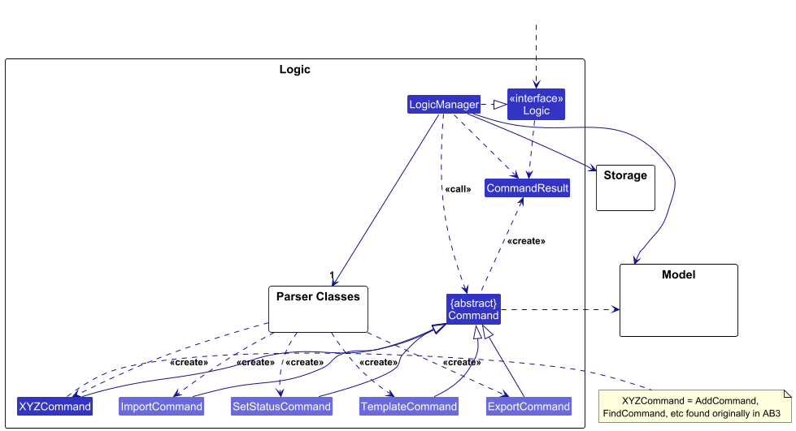

The sequence diagram below illustrates the interactions within the `Logic` component, taking `execute("delete 1")` API call as an example.


How the `Logic` component works:

1. When `Logic` is called upon to execute a command, it is passed to an `AddressBookParser` object which in turn creates a parser that matches the command (e.g., `DeleteCommandParser`) and uses it to parse the command.
1. This results in a `Command` object (more precisely, an object of one of its subclasses e.g., `DeleteCommand`) which is executed by the `LogicManager`.
1. The command can communicate with the `Model` when it is executed (e.g. to delete a person).<br>
   Note that although this is shown as a single step in the diagram above (for simplicity), in the code it can take several interactions (between the command object and the `Model`) to achieve.
1. The result of the command execution is encapsulated as a `CommandResult` object which is returned back from `Logic`.

Here are the other classes in `Logic` (omitted from the class diagram above) that are used for parsing a user command:

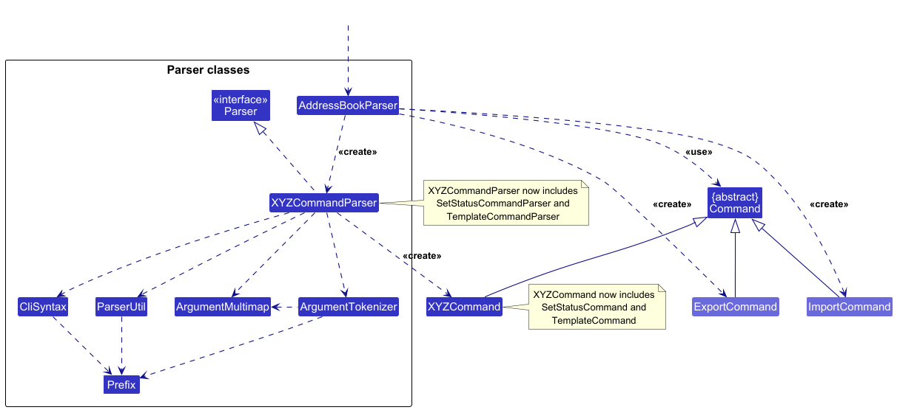

How the parsing works:
* When called upon to parse a user command, the `AddressBookParser` class creates an `XYZCommandParser` (`XYZ` is a placeholder for the specific command name e.g., `AddCommandParser`) which uses the other classes shown above to parse the user command and create a `XYZCommand` object (e.g., `AddCommand`) which the `AddressBookParser` returns back as a `Command` object.
* All `XYZCommandParser` classes (e.g., `AddCommandParser`, `DeleteCommandParser`, ...) inherit from the `Parser` interface so that they can be treated similarly where possible e.g, during testing.

### Model component
**API** : [`Model.java`](https://github.com/AY2526S1-CS2103T-T08-2/tp/tree/master/src/main/java/seedu/address/model/Model.java)

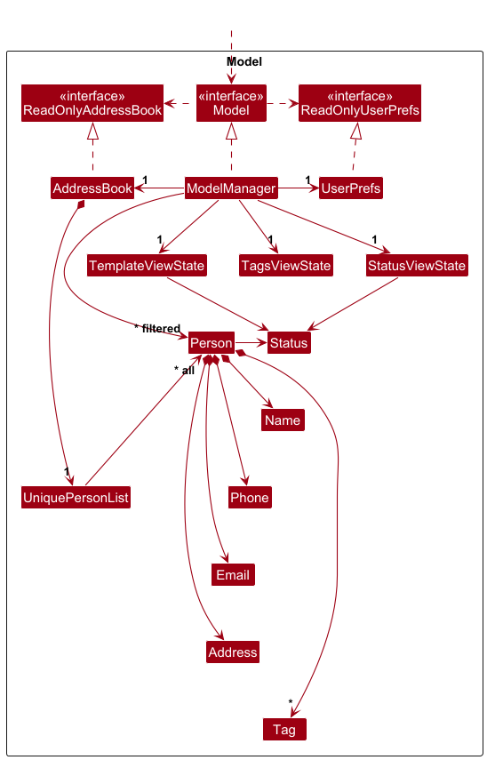


The `Model` component,

* stores the address book data i.e., all `Person` objects (which are contained in a `UniquePersonList` object).
* stores the currently 'selected' `Person` objects (e.g., results of a search query) as a separate _filtered_ list which is exposed to outsiders as an unmodifiable `ObservableList<Person>` that can be 'observed' e.g. the UI can be bound to this list so that the UI automatically updates when the data in the list change.
* stores a `UserPrefs` object that represents the user's preferences. This is exposed to the outside as `ReadOnlyUserPrefs` objects.
* stores view state objects (`StatusViewState`, `TagsViewState`, `TemplateViewState`) as observable properties that track the current UI filter and display states. These are exposed as `ReadOnlyObjectProperty` instances that the UI can observe for reactive updates.
* does not depend on any of the other three components (as the `Model` represents data entities of the domain, they should make sense on their own without depending on other components)

<div markdown="span" class="alert alert-info">:information_source: **Note:** An alternative (arguably, a more OOP) model is given below. It has a `Tag` list in the `AddressBook`, which `Person` references. This allows `AddressBook` to only require one `Tag` object per unique tag, instead of each `Person` needing their own `Tag` objects.<br>


</div>


### Storage component

**API** : [`Storage.java`](https://github.com/AY2526S1-CS2103T-T08-2/tp/tree/master/src/main/java/seedu/address/storage/Storage.java)

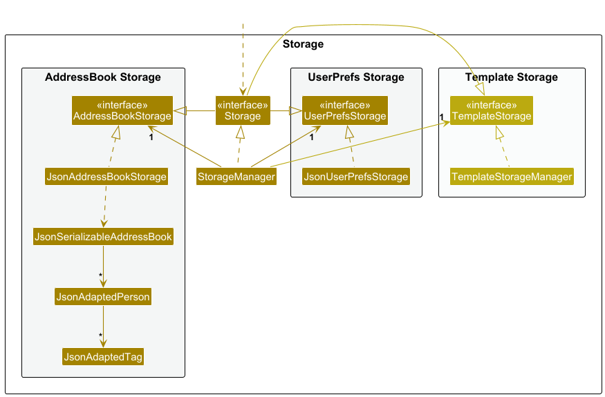

The `Storage` component,
* can save both address book data and user preference data in JSON format, and read them back into corresponding objects.
* inherits from both `AddressBookStorage`, `UserPrefStorage` and `TemplateStorage`, which means it can be treated as either one (if only the functionality of only one is needed).
* uses a facade pattern and delegates storage operations to three specialized storage implementations:
  * `JsonAddressBookStorage` — Handles address book persistence using JSON format
  * `JsonUserPrefsStorage` — Handles user preferences persistence using JSON format
  * `TemplateStorageManager` — Handles email templates persistence as individual text files


### Common classes

Classes used by multiple components are in the `seedu.address.commons` package.

--------------------------------------------------------------------------------------------------------------------

## **Implementation**

This section describes some noteworthy details on how certain features are implemented.

### Status View and Tag View Feature

#### Overview

The Status View and Tag View feature provides visual feedback to users about which filters are currently active when using the `find` command. When users search for customers by status (e.g., `find s:Contacted`) or tags (e.g., `find t:friends`), dedicated UI panels automatically update to display the active filters, making it easy to see what subset of data is being viewed.

#### Architecture

The implementation follows the **Observer Pattern** using JavaFX's property binding mechanism to automatically sync UI state with model state.

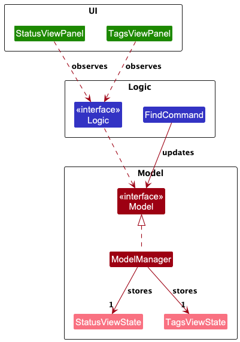

**Key Components:**

1. **Model Layer:**
   - `StatusViewState` and `TagsViewState`: Immutable state objects that represent current filter states
   - `ModelManager`: Stores these states as `ObjectProperty` objects and exposes them via the `Model` interface

2. **Logic Layer:**
   - `Logic` interface: Exposes `getStatusViewStateProperty()` and `getTagsViewStateProperty()` methods
   - `FindCommand`: Updates the view states in `Model` when executing filter operations

3. **UI Layer:**
   - `StatusViewPanel` and `TagsViewPanel`: Observe the properties exposed by `Logic` and automatically update their display
   - UI components depend on the `Logic` abstraction, maintaining proper architectural layering

#### Implementation Details

The following sequence diagram shows how the view states are updated when a user executes `find s:Contacted t:friends`:

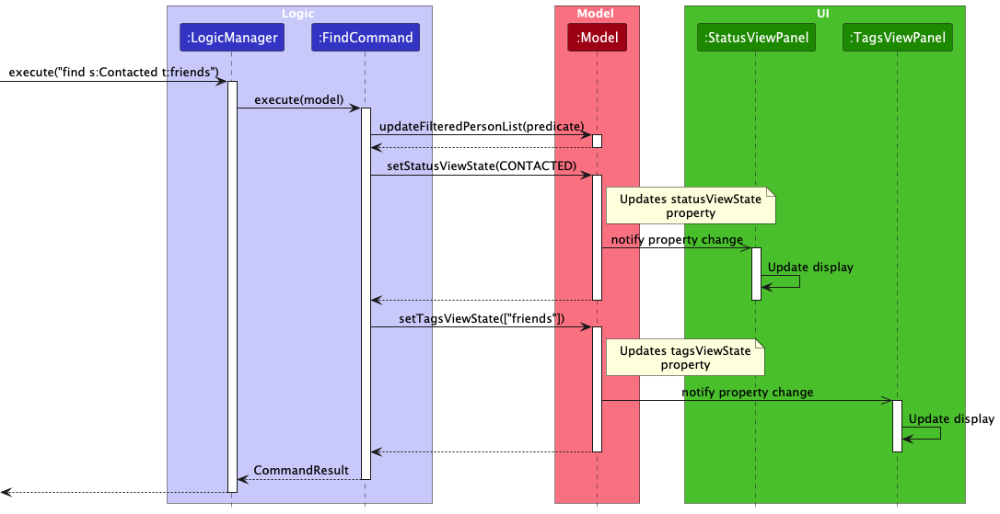

**Step-by-step flow:**

1. User executes a `find` command with status/tag filters
2. `LogicManager` parses and creates a `FindCommand`
3. `FindCommand.execute()` is called:
   - Updates the filtered person list in `Model`
   - Calls `model.setStatusViewState()` with the appropriate `StatusViewState`
   - Calls `model.setTagsViewState()` with the appropriate `TagsViewState`
4. `ModelManager` updates its `ObjectProperty` fields
5. JavaFX property listeners in `StatusViewPanel` and `TagsViewPanel` are automatically triggered
6. UI panels update their labels to display the active filters

#### Design Considerations

**Aspect: How to represent filter state in the UI**

* **Alternative 1 (Chosen):** Use explicit state objects (`StatusViewState`, `TagsViewState`) to track user intent
  * Pros: UI displays what the user explicitly searched for (intent), not just the consequence. Handles edge cases where multiple filter combinations produce the same result. Clear separation of concerns.
  * Cons: Additional state management complexity, requires synchronization between filter predicates and view states

* **Alternative 2:** Derive view state from `FilteredPersonList`
  * Pros: Single source of truth, no state synchronization needed, simpler implementation
  * Cons: UI displays consequence rather than intent. For example, if a user searches for `s:Contacted` but no customers have that status, the filtered list would be empty and the UI couldn't distinguish whether filters were applied or not. Cannot accurately determine which specific filters were applied if multiple filter combinations produce the same filtered list.

**Aspect: How to communicate filter state to UI**

* **Alternative 1:** Direct UI method calls from Command classes
  * Pros: Simpler to understand, explicit control flow
  * Cons: Violates architectural boundaries (Logic calling UI directly) and tight coupling!!

**Aspect: Where to store view state**

* **Alternative 1 (Chosen):** Store in `Model` layer
  * Pros: Centralized state management, follows MVC pattern, testable
  * Cons: Model becomes slightly more complex

* **Alternative 2:** Store in UI components only
  * Pros: Simpler Model layer
  * Cons: State is scattered, harder to test, UI must deduce state from filtered list

### Template Feature

#### Implementation

The template feature allows salespersons to create, edit, and copy email templates associated with different contact statuses. This streamlines the process of sending personalized emails to contacts at different stages of the sales process.

The template mechanism is facilitated by `TemplateStorage`, `TemplateCommand`, and `TemplateViewState`. It uses the following key components:

* `TemplateStorage` — Interface for reading and writing template files.
* `TemplateStorageManager` — Concrete implementation that stores templates as text files in the data directory.
* `TemplateCommand` — Command that handles both opening templates for editing and saving edited templates.
* `TemplateViewState` — Model class that tracks the currently displayed template (status and content).
* `TemplateViewPanel` — UI component that displays the template editor.

These operations are exposed in the `Model` interface as:
* `Model#getTemplateViewStateProperty()` — Returns an observable property for the current template state.
* `Model#setTemplateViewState(TemplateViewState)` — Updates the template view state.

And in the `Storage` interface as:
* `Storage#readTemplate(Status)` — Reads a template for a specific status.
* `Storage#saveTemplate(Status, String)` — Saves template content for a specific status.

Given below is an example usage scenario and how the template mechanism behaves at each step.

Step 1. The salesperson launches the application. The `TemplateStorage` is initialized and ready to read/write template files in the data directory. No template is currently being viewed, so `TemplateViewState` is null.

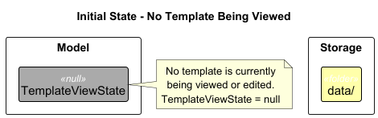

Step 2. The salesperson executes `template s:CONTACTED` to open the template for contacted clients. The `TemplateCommand` calls `Storage#readTemplate(Status.CONTACTED)` to retrieve the template content (or default template if none exists), then calls `Model#setTemplateViewState(TemplateViewState)` to display it in the template editor.

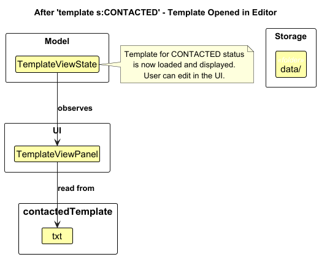

Step 3. The salesperson edits the template content directly in the `TemplateViewPanel`. The changes are stored in the UI component but not yet saved to persistent storage. The model's `TemplateViewState` is updated when the salesperson types.

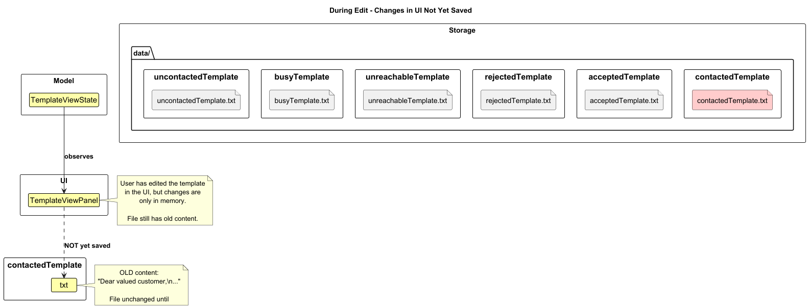

<div markdown="span" class="alert alert-info">:information_source: **Note:** The template content is only saved to storage when the `template save` command is explicitly executed. Simply editing the text does not persist changes.

</div>

Step 4. The salesperson decides to save the edited template by executing `template save`. The `TemplateCommand` retrieves the current `TemplateViewState` from the model, extracts the status and content, and calls `Storage#saveTemplate(Status, String)` to persist the changes.

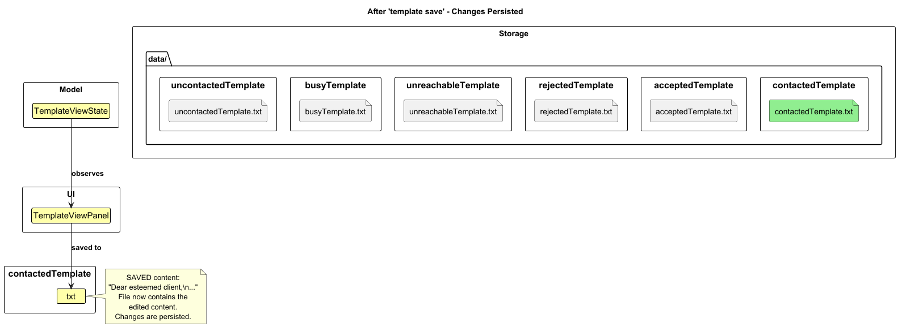

<div markdown="span" class="alert alert-info">:information_source: **Note:** If the salesperson switches to a different view (e.g., executes `list` or `find`) without saving, the edited content is discarded and not persisted.

</div>

The following sequence diagram shows how the template open operation goes through the `Logic` component:

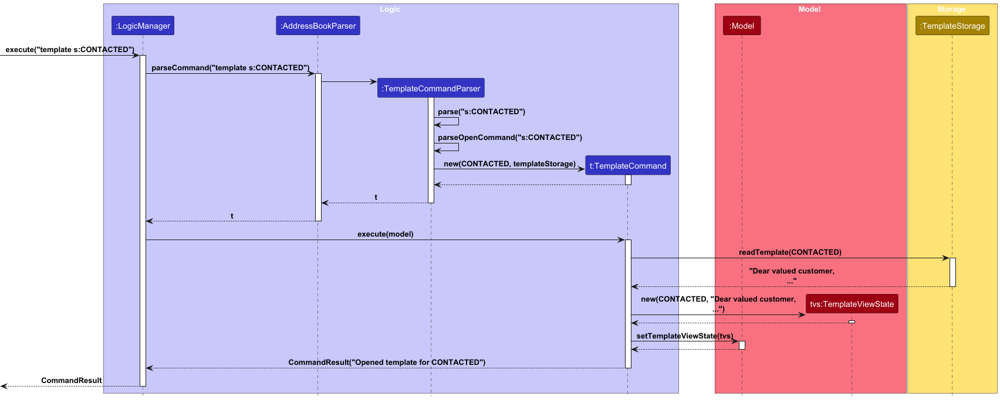

The following sequence diagram shows how the template save operation works:

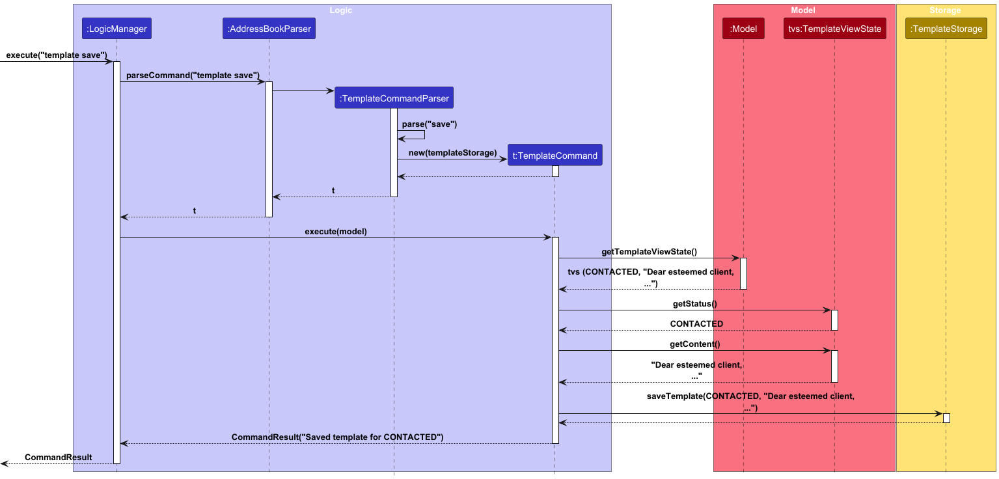

Step 5. The salesperson can also copy a template directly to the clipboard without opening the editor by executing `copy s:CONTACTED`. This reads the template and places it on the system clipboard for pasting into an email client.

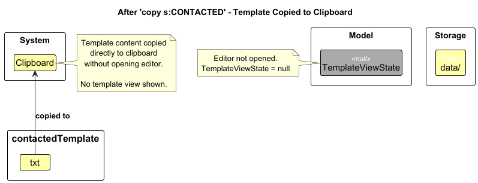

The following sequence diagram shows how the copy operation works:

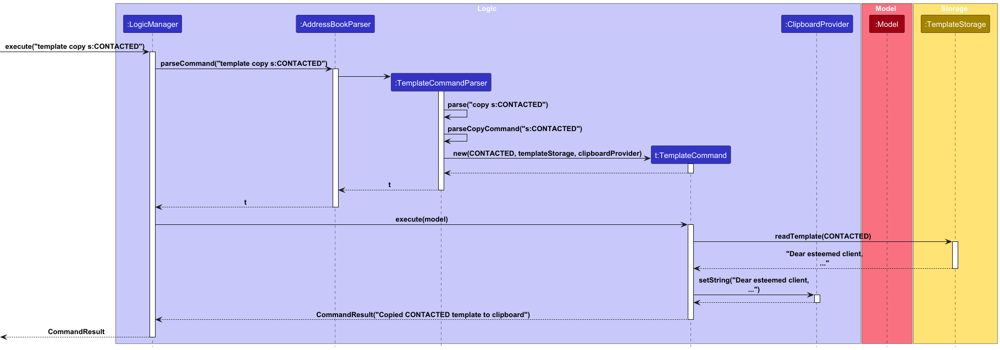

The template feature supports all six contact statuses (UNCONTACTED, CONTACTED, REJECTED, ACCEPTED, UNREACHABLE, BUSY), with each status having its own independent template file.

#### Design considerations:

**Aspect: How templates are stored:**

* **Alternative 1 (current choice):** Store each template as a separate text file per status.
  * Pros: Simple to implement, easy to manually edit templates outside the application, human-readable format.
  * Cons: Requires file I/O for each template operation, potential for file system errors.

* **Alternative 2:** Store all templates in a single JSON file.
  * Pros: Single file to manage, consistent with address book storage format, easier to backup.
  * Cons: More complex serialization/deserialization, harder for users to manually edit, risk of corrupting all templates if JSON is malformed.

**Aspect: When to save template changes:**

* **Alternative 1 (current choice):** Require explicit `template save` command.
  * Pros: Gives users control over when changes are persisted, prevents accidental overwrites, clear user intent.
  * Cons: Users might forget to save and lose their edits.

* **Alternative 2:** Auto-save on every keystroke or after a delay.
  * Pros: No risk of losing work, more convenient for users.
  * Cons: May cause performance issues with frequent file I/O, harder to implement "cancel" functionality, could save incomplete/incorrect templates.

**Aspect: Template editor vs. clipboard copy:**

* **Current implementation:** Provides both `template s:STATUS` (opens editor) and `copy s:STATUS` (direct clipboard copy).
  * Pros: Flexibility for different workflows - edit for customization, copy for quick use.
  * Cons: Two different commands to learn and maintain.

* **Alternative:** Only provide editor, remove direct copy command.
  * Pros: Simpler command set, encourages review before sending.
  * Cons: Less efficient for users who want to quickly copy without viewing.

### Status Feature

#### Implementation

The status command feature allows users to set and track the contact status of each person in the address book. The status command is facilitated by the `SetStatusCommand` class which implements the `Command` interface. It allows users to mark contacts with predefined statuses. The only valid statuses are: "Uncontacted", "Contacted", "Rejected", "Accepted", "Unreachable", and "Busy".

The implementation is supported by the following key components:

* `SetStatusCommand` - Handles the execution of the status command.
* `Status` - Represents the contact status of a person as an immutable value object.
* `StatusValue` - An enum defining all possible status values, and is nested in the Status class.
* `Person` - Contains a person's status along with other attributes.

Below is the class diagram showing the relationship between these components:

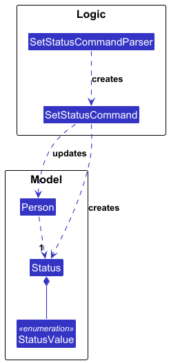

The status command is executed through the following sequence of steps:

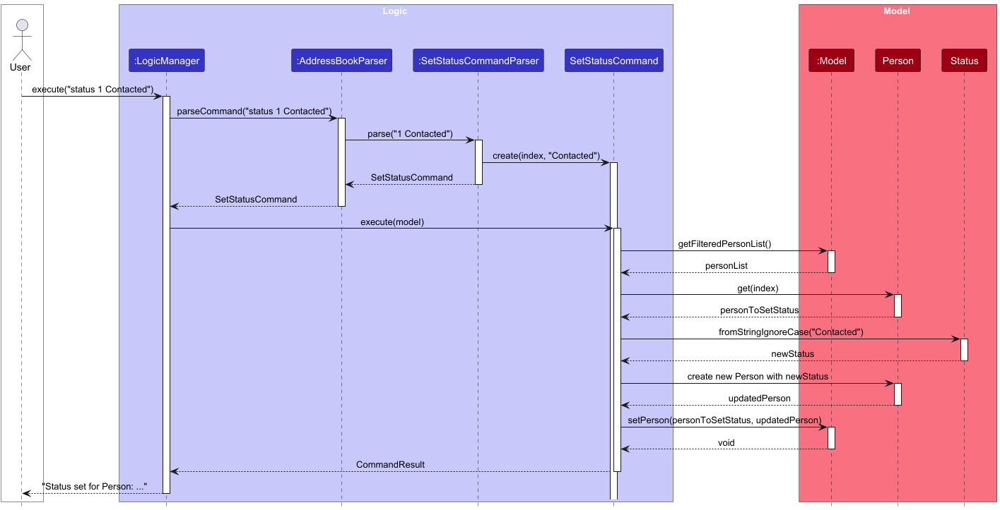

**Step-by-step flow:**

1.  The user executes the command `status 1 Contacted`.
2.  The `LogicManager` receives the command and passes it to the `AddressBookParser`.
3.  The `AddressBookParser` identifies the command word as `status` and delegates the parsing of the arguments to `SetStatusCommandParser`.
4.  `SetStatusCommandParser` parses the index `1` and the string "Contacted" to create a `SetStatusCommand` object.
5.  The `SetStatusCommand` is returned to the `LogicManager`.
6.  The `LogicManager` calls the `execute()` method of the `SetStatusCommand`.
7.  The command retrieves the person at the specified index from the `Model`.
8.  It then creates a new `Status` object from the input string.
9.  A new `Person` object is created with the updated status.
10. The `Model` is updated with the new `Person` object.
11. A `CommandResult` is returned to the `LogicManager`, which is then displayed to the user.

#### Design Considerations

**Aspect: Status Value Implementation**

* **Alternative 1 (current choice)**: Use enum-based Status class with predefined values
   * Pros:
      * Type-safe implementation prevents invalid status values.
      * Clear indication of all available status options.
      * Easy to validate input strings.
   * Cons:
      * Adding new status values requires code changes.
      * Less flexible for user customisation.

* **Alternative 2**: Use string-based status implementation
   * Pros:
      * Flexible - users could create custom status values.
      * Easier to extend without code changes.
    * Cons:
      * Less type safety.
      * More complex validation required.

**Aspect: Default Status Behavior**

* **Alternative 1 (current choice)**: Default to "Uncontacted" for empty/null input
   * Pros:
      * Consistent with the use case of tracking initial contact status
      * Prevents null status values
   * Cons:
      * May not be intuitive that empty input has a default value

* **Alternative 2**: Require explicit status input
   * Pros:
      * More explicit - users must state their intention
      * Prevents accidental status changes
   * Cons:
      * More inconvenient for salespeople when they want to reset everyone's status (e.g. when starting a new sale)

### Export Command Feature

#### Implementation

The export command feature allows users to export the address book data in JSON format to the system clipboard. It is implemented through the `ExportCommand` class and supported by two key interfaces:

*   `ClipboardProvider` - For copying data to system clipboard.
*   `FileSystemProvider` - For reading data from files.

The implementation is supported by these components:

*   `SystemClipboardProvider` - Concrete implementation for clipboard operations.
*   `SystemFileSystemProvider` - Concrete implementation for file system operations.
*   `JsonAddressBookUtil` - Handles JSON data conversion.

Below is the class diagram for the export command:

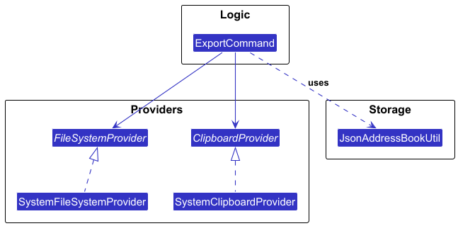

The sequence diagram below shows the execution flow of the export command:

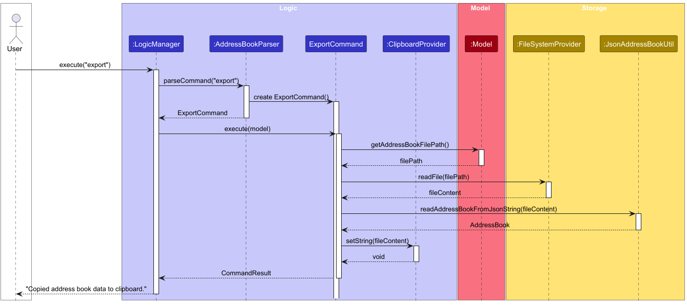

The typical flow of operations is:

1.  User executes the `export` command.
2.  `LogicManager` calls `AddressBookParser` which creates an `ExportCommand`.
3.  The `execute()` method of `ExportCommand` is called.
4.  The command gets the address book file path from the `Model`.
5.  It uses the `FileSystemProvider` to read the content of the address book file.
6.  The content is validated to ensure it is a valid JSON representation of an address book using `JsonAddressBookUtil`.
7.  The content is then copied to the system clipboard using the `ClipboardProvider`.
8.  A `CommandResult` is returned and displayed to the user.

#### Design Considerations

**Aspect: Export Format**

* **Alternative 1 (current choice)**: Use JSON format
   * Pros:
      * Standard format with wide tool support
      * Human-readable
      * Preserves data structure
   * Cons:
      * Larger size compared to binary formats, might be too large for some systems' clipboard to handle
      * May expose sensitive data in readable form

* **Alternative 2**: Use binary format
   * Pros:
      * More compact
      * Data not human-readable (better for sensitive information)
   * Cons:
      * Requires special tools to read/edit
      * Less interoperable with other systems

**Aspect: Export Destination**

* **Alternative 1 (current choice)**: Export contacts directly to clipboard
   * Pros:
      * Convenient for both backup and sharing
      * Easier for salespeople to use, since they may not be familiar with how to locate save files
   * Cons:
      * More complex implementation
      * More code to maintain

* **Alternative 2**: Direct user to storage file
   * Pros:
      * Simpler implementation
   * Cons:
      * Less convenient for quick sharing
      * Requires file system access and understanding

### Import Feature

#### Implementation

The import feature enables salespersons to share address book data between team members via the system clipboard. This supports team collaboration workflows where managers distribute lead lists or team members share contact databases.

The import mechanism is facilitated by `ImportCommand`, and `ClipboardProvider`. It uses the following key components:

* `ImportCommand` — Reads JSON from clipboard and replaces the current address book
* `ClipboardProvider` — Abstraction for clipboard operations (enables testing with mock clipboard)
* `FileSystemProvider` — Abstraction for file system operations (enables testing without actual file I/O)
* `JsonAddressBookUtil` — Utility for JSON serialization/deserialization
* `ImportWindow` — UI window for previewing import data before confirming

The following activity diagram illustrates the complete workflow of sharing contacts between team members via an external messaging application:

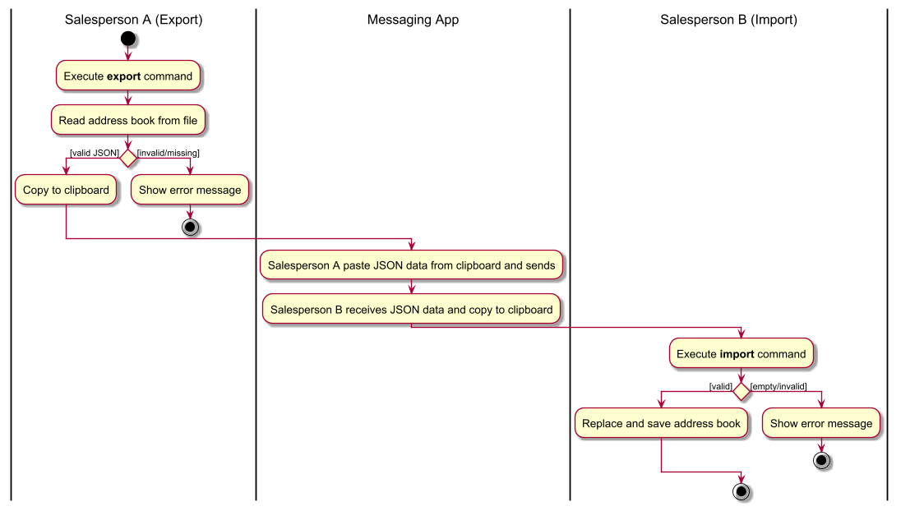

#### Design Considerations

**Aspect: Clipboard vs file-based import**

* **Alternative 1 (current choice):** Use system clipboard for data transfer.
  * Pros: Quick and convenient. Works across different file systems and network drives. No file permissions issues. Platform-independent.
  * Cons: Large address books might exceed clipboard limits. Data is not persisted if clipboard is cleared. However, we accept this as a trade-off because clipboard should not be used for persistence.

* **Alternative 2:** Export/import via file selection dialog.
  * Pros: Better for very large datasets. Persistent storage.
  * Cons: Slower workflow. Requires file system navigation. Path/permission issues. Reliance on the operating system's implementation makes it hard to ensure that it would be bug-free, and violates the constraints.

**Aspect: Import replaces vs merges**

* **Alternative 1 (current choice):** Import replaces entire address book.
  * Pros: Simple and predictable behavior. No duplicate handling needed. Clean state after import.
  * Cons: Destructive operation - loses current data if not exported first. Since sharing of contact is done to allocate the salesperson their new assignment contacts, this behaviour is acceptable.

* **Alternative 2:** Merge imported contacts with existing ones.
  * Pros: Non-destructive. Allows incremental updates.
  * Cons: Complex duplicate detection and resolution. Unclear user expectations for what is considered a conflict or a new entry.

--------------------------------------------------------------------------------------------------------------------

## **Documentation, logging, testing, configuration, dev-ops**

* [Documentation guide](Documentation.md)
* [Testing guide](Testing.md)
* [Logging guide](Logging.md)
* [Configuration guide](Configuration.md)
* [DevOps guide](DevOps.md)

--------------------------------------------------------------------------------------------------------------------

## **Appendix: Requirements**

### Product scope

**Target user profile**:

- Salespersons who manage a large number of contacts
- Prefer desktop apps over other types
- Can type fast and prefer typing to mouse interactions for efficiency
- Need to categorize leads by tags and track sales-specific statuses (e.g., Contacted, Rejected, Accepted)
- Occasionally need to import many contacts at once (e.g., from sales manager assignments)
- Are reasonably comfortable using CLI apps

**Value proposition**: An address book tailored for salespeople to manage contacts significantly faster than a typical mouse/GUI driven app, with support for bulk additions, powerful filtering by name/tag/status, status tracking to streamline outreach workflows, and templated email generation for selected contact cohorts.

**Key features**:

- Add Contact: Add a single contacts in one command
- Edit Contact: Update any field, add/remove tags, set status
- Delete Contact: Remove contacts by index
- List Contact: Display all contacts
- Find Contact: Filter by name, tag, and/or status (case-insensitive, exact match)
- Create and Copy Email Template: Generate email templates for selected tag/status cohorts
- Bulk Import/Export of Contact: Share contacts
- Set Status: Quickly update a contact's status

**Command format conventions**:

- Named parameters use `key:value` format and may appear in any order
- Optional parameters are denoted with square brackets `[]`
- Repeating parameters are denoted with `...`
- Leading/trailing whitespace is trimmed for all fields
- Each named parameter continues till the end of the line or till another parameter

**Field validations for contacts**:

| Field | Validation Rule | Rationale |
|-------|----------------|-----------|
| **Name** | Must contain only alphanumeric characters, spaces, hyphens, apostrophes, slashes, and periods. Cannot be blank or start with whitespace. | Supports international names (e.g., "Mary-Jane", "O'Brien", "Dr. Smith"). |
| **Phone** | Must contain only digits and be at least 3 digits long. | Accommodates both local and international formats without requiring country codes or special characters. Minimum length prevents trivial inputs like "1" or "12". |
| **Email** | Must follow standard email format, which we enforce losely by checking for `@`.<br>- Local part: alphanumeric and special characters (`+`, `_`, `.`, `-`), cannot start/end with special characters<br>- Domain: alphanumeric labels separated by periods, must end with at least 2-character domain label | Helps prevent typo of definitely invalid email address such as "name@", "abcgmail.com" and "@gmail.com" |
| **Address** | Can contain any characters but must not exceed 200 characters. | Allows flexibility for diverse address formats while preventing unreasonably long inputs that could affect UI display. |
| **Tag** | Must be alphanumeric only (no spaces or special characters). | Tags, used for categorising, should be a single word. Alphanumeric restriction prevents parsing conflicts with command syntax. |
| **Status** | View the list below table for the list of status, and recommended meaning. Defaults to "Uncontacted" if not specified. | Helps to track contacts for the sales workflow. Case-insensitive matching improves user experience. |

**Valid contact statuses**:

- **Uncontacted**: Contact has not been contacted yet (default)
- **Contacted**: Contact has been contacted
- **Rejected**: Contact has rejected the sale
- **Accepted**: Contact has accepted the sale
- **Unreachable**: Contact could not be reached
- **Busy**: Contact is busy and should be contacted later

### User stories

Priorities: Essential (must have) - `* * *`, Typical (nice to have) - `* *`, Novel (unlikely to have) - `*`

| Priority | As a …               | I want to …                                                        | So that I can…                                                                 |
| -------- | -------------------- | ------------------------------------------------------------------ | ------------------------------------------------------------------------------ |
| `* * *`  | salesperson          | add contacts                                                       | see their details in the future                                                |
| `* * *`  | salesperson          | delete contacts                                                    | don't over clutter my contact book                                             |
| `* *`    | salesperson          | delete multiple contacts                                           | ensure that PDPA retention limitation is adhered to                            |
| `* * *`  | careless salesperson | edit contact details                                               | ensure the data is accurate                                                    |
| `* * *`  | salesperson          | search by name                                                     | easily find contacts by name due to the large number of contacts               |
| `* *`    | salesperson          | search by tags                                                     | easily find contacts by tags                                                   |
| `* *`    | salesperson          | search by status                                                   | easily find contacts by their status                                           |
| `* * *`  | salesperson          | list all contacts                                                  | know what contacts I have saved                                                |
| `* * *`  | forgetful user       | have my edits autosaved                                            | data won't be lost if I forget to save it                                      |
| `* *`    | salesperson team IC  | export and share the contacts I have with others easily            | don't need my team to use each others' accounts                                |
| `* *`    | salesperson team IC  | import contacts shared by others                                   | quickly add contacts provided by my team                                       |
| `* *`    | salesperson          | add tags to contacts                                               | categorise them for filtering                                                  |
| `* *`    | salesperson          | add multiple tags to each contact                                  | better categorise contacts with different characteristics                      |
| `* *`    | salesperson          | set a status for each contact                                      | track which contacts have been contacted, accepted, rejected, etc.             |
| `*`      | salesperson          | create and edit email templates for different contact types        | save time from writing up the same outreach materials over and over again      |
| `*`      | salesperson          | copy a template message to clipboard                               | quickly paste it into my email application                                     |
| `*`      | salesperson          | mark clients as rejected                                           | avoid wasting time by contacting them again                                    |
| `*`      | busy salesperson     | mark clients based on how receptive they are                       | focus my limited time on those likely to buy the product                       |

### Use cases

#### Use case: UC01 - Add new contact<br/>

**System:** Contact Management System (CMS)

**Actor:** Salesperson<br/>

**Guarantees:**

* Contact is created only if all required fields are valid.
* On validation error, no contacts are added.

**MSS:**

1. Salesperson chooses to add a new contact.
2. Salesperson enters the add command with contact details.
3. Salesperson submits the command.
4. CMS validates the details.
5. CMS creates the contact and displays a confirmation message.<br/>
Use case ends.

**Extensions:**<br/>

4a. CMS detects an error in the entered data.<br/>
   4a1. CMS indicates an error has happened.<br/>
   Use case resumes from step 2.


#### Use case: UC02 - Add multiple contacts

**System:** Contact Management System (CMS)

**Actor:** Salesperson

**Guarantees:**

- Contact is created only if all required fields are valid.
- On validation error, no contacts are added.

**MSS:**

1. Salesperson chooses to add a new contact.
2. Salesperson enters the add command with contact details.
3. CMS creates the contact and displays a confirmation message.<br/>
   Use case ends.

**Extensions:**<br/>

2a. CMS detects an error in the entered data.<br/>
2a1. CMS indicates an error has happened.<br/>
Use case resumes from step 2.

2b. Contact already exists (same name).<br/>
2b1. CMS indicates an error.
Use case ends.

#### Use case: UC02 - Import address book from clipboard

**System:** Contact Management System (CMS)

**Actor:** Salesperson

**Guarantees:**

- On success, the address book on disk is replaced by the imported data and the UI reflects the new data.
- No changes are made to the current address book if the clipboard is empty or contains invalid JSON.

**MSS:**

1. Salesperson copies the address book JSON to the system clipboard.
2. Salesperson issues the `import` command.
3. CMS reads and validate the clipboard content.
   Use case ends.

**Extensions:**

3a. Clipboard is empty.<br />
3a1. CMS displays: "Clipboard does not contain any text to import".<br />
Use case ends.

3b. Clipboard content is not valid address book JSON or fails validation.<br />
3b1. CMS displays: "Failed to import: Clipboard does not contain valid address book JSON.".<br />
Use case ends.

#### Use case: UC03 - List all contacts

**System:** Contact Management System (CMS)

**Actor:** Salesperson

**Guarantees:**

* Listing does not modify any data.
* The latest saved state of contacts is displayed.

**MSS:**

1. Salesperson chooses to view all contacts.
2. Salesperson enters the list command.
3. CMS displays all contacts.<br/>
Use case ends.

**Extensions:**

3a. The contact list is empty.<br/>
   3a1. CMS indicates that no contacts are found.
   Use case ends.


#### Use case: UC04 - Find customers by various criteria

**System:** Contact Management System (CMS)

**Actor:** Salesperson

**Guarantees:**

* Search does not modify customer data.
* Tag view and status view panels update to reflect active filters.

**MSS:**

1. Salesperson chooses to find customers by one or more criteria (name, tag, status, phone, email).
2. Salesperson enters the find command with specified search criteria.
3. CMS searches for customers matching ALL specified criteria (AND logic between different types, OR logic within same type).
4. CMS displays the matching customers and updates the tag view and status view panels to show active filters.<br/>
Use case ends.

**Extensions:**

2a. Invalid search criteria format provided.<br/>
   2a1. CMS indicates invalid command format and shows usage instructions.<br/>
   Use case ends.

3a. No customers match the search criteria.<br/>
   3a1. CMS displays an empty list while keeping the filters visible in tag view and status view to show search intent.<br/>
   Use case ends.


#### Use case: UC05 - Find contact by status

**System:** Contact Management System (CMS)

**Actor:** Salesperson

**Guarantees:**

* Filtering does not modify contact data.

**MSS:**

1. Salesperson chooses to find contacts by status.
2. Salesperson specifies the status.
3. CMS searches for contacts with the specified status.
4. CMS displays the matching contacts.<br/>
Use case ends.

**Extensions:**

2a. The specified status does not exist.<br/>
   2a1. CMS indicates that an error has happened.<br/>
   Use case ends.

4a. No contacts match the specified status.<br/>
   4a1. CMS indicates that no contacts are found.<br/>
   Use case ends.


#### Use case: UC06 - Open and edit email template

**System:** Contact Management System (CMS)

**Actor:** Salesperson

**Guarantees:**

* Opening a template does not modify any data.
* Template is saved only when the save command is explicitly issued.
* If the template view is switched without saving, no changes are will be saved.

**MSS:**

1. Salesperson chooses to open an email template for a specific status.
2. Salesperson enters the template command with the status.
3. CMS retrieves the template for the specified status.
4. CMS displays the template in an editable view.
5. Salesperson edits the template content.
6. Salesperson issues the save command.
7. CMS saves the updated template.<br/>
Use case ends.

**Extensions:**

*a. At any time, Salesperson enters a different command (e.g., list, find).<br/>
   *a1. CMS switches back to the main view and discards any unsaved edits.<br/>
   Use case ends.

2a. The specified status is invalid.<br/>
   2a1. CMS indicates that an error has happened.<br/>
   Use case ends.

3a. No template exists for the specified status.<br/>
   3a1. CMS displays an empty template.<br/>
   Use case resumes from step 4.


#### Use case: UC07 - Copy email template to clipboard

**System:** Contact Management System (CMS)

**Actor:** Salesperson

**Guarantees:**

* Copying a template does not modify any data.
* The template content is placed on the system clipboard.

**MSS:**

1. Salesperson chooses to copy an email template for a specific status.
2. Salesperson enters the copy template command with the status.
3. CMS retrieves the template for the specified status.
4. CMS copies the template content to the clipboard.
5. CMS displays a confirmation message.<br/>
Use case ends.

**Extensions:**

2a. The specified status is invalid.<br/>
   2a1. CMS indicates that an error has happened.<br/>
   Use case ends.

3a. No template exists for the specified status.<br/>
   3a1. CMS copies an empty string to the clipboard.<br/>
   Use case resumes from step 4.


#### Use case: UC08 - Edit contact

**System:** Contact Management System (CMS)

**Actor:** Salesperson

**Guarantees:**

* Only the specified fields are updated, the other fields remain unchanged.
* On validation error, no changes are applied.

**MSS:**

1. Salesperson chooses to edit a contact's information.
2. Salesperson specifies the contact ID and fields to edit.
3. CMS validates the updated details.
4. CMS updates the contact information.<br/>
Use case ends.

**Extensions:**

2a. The specified contact ID does not exist.<br/>
   2a1. CMS indicates that an error has happened.  <br/>
   Use case resumes from step 2.

3a. CMS detects an error in the entered data.<br/>
   3a1. CMS indicates that an error has happened.  <br/>
   Use case resumes from step 2.


#### Use case: UC09 - Delete contact(s)

**System:** Contact Management System (CMS)

**Actor:** Salesperson

**Guarantees:**

* Deletion removes only the specified contact(s) without modifying other data.
* All specified contacts must be valid or none will be deleted.
* Deletion is irreversible once confirmed.
* On failure, no deletion occurs.
* All specified indices must be valid; if any index is invalid, no deletions are performed.

**MSS:**

1. Salesperson chooses to delete one or more contacts.
2. Salesperson specifies the contact ID(s) to delete.
3. CMS validates all contact IDs.
4. CMS deletes the contact(s) and displays a confirmation.<br/>
Use case ends.

**Extensions:**

3a. One or more of the given contact IDs are invalid.<br/>
   3a1. CMS displays which contact ID(s) are invalid and indicates that no deletions were performed.<br/>
   Use case resumes at step 2.

#### Use case: UC10 - Set contact status

**System:** Contact Management System (CMS)

**Actor:** Salesperson

**Guarantees:**

* If an invalid status is provided, no changes are made.

**MSS:**

1. Salesperson chooses to update a contact's status.
2. Salesperson specifies the contact ID and new status.
3. CMS validates the contact ID and status.
4. CMS updates the contact's status and displays a confirmation message.<br/>
Use case ends.

**Extensions:**

2a. No status is specified.<br/>
   2a1. CMS indicates that an error has happened.<br/>
   Use case ends.

3a. The specified status is invalid.<br/>
   3a1. CMS indicates that an error has happened.<br/>
   Use case ends.

3b. The specified contact ID does not exist.<br/>
   3b1. CMS indicates that an error has happened.<br/>
   Use case ends.

#### Use case: UC11 - Export Contacts

**System:** Contact Management System (CMS)

**Actor:** Salesperson

**Guarantees:**
* Export copies the exact state of the address book to clipboard as JSON.
* All contact data is preserved during export.
* The operation does not modify any existing data.

**MSS:**

1. Salesperson chooses to export contacts.
2. Salesperson enters the export command or presses F8.
3. CMS reads the address book data.
4. CMS converts the data to JSON format.
5. CMS copies the JSON to the system clipboard.
6. CMS displays a success message.<br/>
Use case ends.

**Extensions:**

3a. CMS cannot read the address book file.<br/>
   3a1. CMS shows an error message.<br/>
   Use case ends.

5a. System clipboard is unavailable.<br/>
   5a1. CMS shows an error message.<br/>
   Use case ends.

#### Use case: UC12 - Import Contacts

**System:** Contact Management System (CMS)

**Actor:** Salesperson

**Guarantees:**
* Import either succeeds completely or fails without modifying existing data.

**MSS:**

1. Salesperson chooses to import contacts.
2. Salesperson enters the import command.
3. CMS retrieves JSON data from the system clipboard.
4. CMS validates the JSON format and contact data.
5. CMS overwrites the existing address book with the imported data.
6. CMS displays a success message.<br/>
Use case ends.

**Extensions:**
1a. Salesperson presses F7 or clicks the import button under File.<br/>
   1a1. CMS shows an import contact preview window.<br/>
   1a2. User clicks paste JSON button.<br/>
   Use case resumes at step 3.

3a. Clipboard is empty.<br/>
   3a1. CMS shows an error message.<br/>
   Use case ends.

3b. Cannot access system clipboard.<br/>
   3b1. CMS shows an error message.<br/>
   Use case ends.

4a. The JSON data is invalid or malformed.<br/>
   4a1. CMS shows an error message describing the issue.<br/>
   4a2. No changes are made to the existing data.<br/>
   Use case ends.

### Non-Functional Requirements

1. Should work on any _mainstream OS_ as long as it has Java `17` or above installed.
2. Should be able to hold up to 1000 persons without a noticeable sluggishness in performance for typical usage, especially in things like returning search results or filtering by label.
3. A user with above average typing speed (>60 WPM) for regular English text (i.e. not code, not system admin commands) should be able to accomplish most of the tasks faster using commands than using the mouse.
4. The commands should follow **consistent patterns** to reduce confusion and make it easier to learn them.
5. User data should be **automatically saved** after commands such that user data is not lost even after unexpected shutdowns.
6. The program should be able to be self-contained as a single JAR/ZIP file that should work without requiring any installer.
7. The GUI should _work well_ for standard screen resolutions 1920x1080 and higher, and, for screen scales 100% and 125%, meaning that no clipping or obvious bugs show in the GUI.
8. The GUI should be _usable_ (i.e., all functions can be used even if the user experience is not optimal) for resolutions 1280x720 and higher, and, for screen scales 150%.
9. There should not be a server component. All data should be stored on the user's local machine.

### Glossary

* **Address Book**: The core domain model of the application. Represents the collection of all contacts and provides operations for managing them.
* **API (Application Programming Interface)**: The set of public methods and interfaces that define how components interact with each other. Each major component (UI, Logic, Model, Storage) defines its API through an interface.
* **Case-insensitive**: String matching that ignores letter casing (e.g., "John" matches "john", "JOHN"). Implemented using `toLowerCase()` or `equalsIgnoreCase()` in predicates.
* **CLI (Command-Line Interface)**: Text-based user interface where users type commands. Parsed by `AddressBookParser` and individual `XYZCommandParser` classes.
* **Clipboard**: System clipboard abstracted through the `ClipboardProvider` interface. Allows copying templates and address book data for external use. Production code uses `SystemClipboardProvider`, tests use stubs.
* **Command**: An executable object representing a user action. All commands extend the abstract `Command` class and implement `execute(Model)`. Examples: `AddCommand`, `DeleteCommand`, `TemplateCommand`.
* **CommandResult**: Encapsulates the outcome of command execution. Contains success/error message and flags indicating UI actions (e.g., `isShowHelp`, `isExit`, `isShowTemplate`).
* **Contact**: Refers to a `Person` object in the domain model. Used interchangeably with "Person" in documentation.
* **Email Template**: Persistent text content associated with a `Status` enum value. Stored in JSON files by `TemplateStorage` and managed via `TemplateCommand`.
* **Export/Import**: Features to serialize/deserialize the entire `AddressBook` to/from clipboard as JSON. Uses `JsonAddressBookUtil` for conversion. Enables data sharing between users.
* **Filter**: Applying a `Predicate<Person>` to the `filteredPersons` observable list in `Model`. Updates the UI to show only matching contacts.
* **GUI (Graphical User Interface)**: The JavaFX-based visual interface. Implemented in the `UI` component with FXML layouts and corresponding controller classes.
* **Index**: A 1-based position reference used in commands to identify contacts in the displayed list. Internally converted to 0-based for `List` operations. Represented by the `Index` class.
* **JAR file**: Java ARchive - executable package containing compiled `.class` files and resources. Built by Gradle and run with `java -jar addressbook.jar`.
* **JSON (JavaScript Object Notation)**: Text-based data format used for persistence. `JsonAdaptedPerson` classes bridge between domain objects and JSON representation. Handled by Jackson library.
* **Mainstream OS**: Windows, Linux, Unix, MacOS - target platforms for the application.
* **Model**: The component responsible for holding application data in memory. Manages `AddressBook`, `UserPrefs`, and filtered lists. Exposes data through `ObservableList` for reactive UI updates.
* **Observer Pattern**: Design pattern used to keep UI synchronized with Model. JavaFX `ObservableList` and `ObjectProperty` notify listeners (UI components) when data changes.
* **Parameter**: Command argument specified with a prefix (e.g., `n:NAME`, `p:PHONE`). Parsed by `ArgumentTokenizer` which splits input into `ArgumentMultimap`.
* **Parser**: Class responsible for converting user input strings into `Command` objects. Follows the hierarchy: `AddressBookParser` → `XYZCommandParser` → `Command`. All parsers implement the `Parser` interface.
* **PDPA (Personal Data Protection Act)**: Singapore's data protection regulation. Application supports compliance through bulk deletion and data export features.
* **Predicate**: A functional interface representing a boolean-valued function. Used extensively for filtering (e.g., `PersonMatchesKeywordsPredicate`, `NameContainsKeywordsPredicate`).
* **Prefix**: A `Prefix` object (e.g., `PREFIX_NAME`, `PREFIX_PHONE`) used by parsers to identify parameter types. Defined in `CliSyntax`.
* **Status**: An enum-like class representing contact lifecycle states (Contacted, Rejected, Accepted, Unreachable, Busy, Uncontacted). Used for filtering and template association.
* **Storage**: The component handling data persistence. Implements both `AddressBookStorage` and `UserPrefStorage` interfaces. Uses JSON format via Jackson library.
* **Tag**: A domain object representing a category label. Each `Person` can have multiple `Tag` objects stored in a `Set<Tag>`. Implemented as immutable value objects.
* **Template Storage**: Subsystem for persisting email templates. Uses `TemplateStorage` interface with file-based implementation (`TemplateStorageManager`). Templates stored as individual files per status.
* **UI Component**: JavaFX-based view layer. Inherits from `UiPart` base class. FXML files in `resources/view` define layouts, Java classes handle logic.
* **UniquePersonList**: Internal data structure in `AddressBook` that ensures no duplicate persons. Duplicates determined by `Person#isSamePerson()` method.
* **Validation**: Input checking performed by parsers and domain objects. For example, `Phone` validates format, `Email` validates structure. Throws `ParseException` or `IllegalArgumentException` on invalid input.
* **ObservableList**: A JavaFX collection that notifies listeners about changes (additions, removals, updates). Used to keep the UI view synchronized with app data in real time.
* **ObjectProperty**: A JavaFX property type that holds and notifies changes to a single object, supporting binding and listeners for UI updates.
* **ClipboardProvider**: An abstraction/interface for operations that interact with the system clipboard (e.g. for copying data or templates programmatically).
* **FileSystemProvider**: Interface that abstracts file read/write operations from the file system for portability and testing.
* **SystemClipboardProvider**: The production implementation of `ClipboardProvider` that interacts with the real system clipboard on the user’s OS.
* **SystemFileSystemProvider**: The production implementation of `FileSystemProvider` that uses the local file system for file operations.
* **JsonAddressBookUtil**: A utility class that handles conversion (serialization/deserialization) between Address Book data structures and JSON format.
* **UiPart**: Abstract Java class that defines common logic for UI components/parts (JavaFX controls) in the app. All custom UI views inherit from this base class
* **ModelManager**: The main implementation of the `Model` interface. Manages, updates, and exposes application data in-memory and propagates property changes to the UI.
* **MainWindow**: The primary application window in the UI, containing CommandBox, PersonListPanel, SidebarPanel, and other subcomponents.
* **CommandBox**: The text input area in the UI where users enter commands.
* **ImportWindow**: A separate UI window dedicated to importing customer data from the clipboard, allowing preview or validation before adding contacts.
* **SidebarPanel**: A UI panel that contains and displays active filters; houses the StatusViewPanel and TagsViewPanel.
* **StatusViewPanel**: UI component that displays the list of currently active status filters applied (e.g., via find command).
* **TagsViewPanel**: UI component that displays the list of currently active tag filters applied (e.g., via find command).
* **TemplateViewPanel**: UI component that allows users to create, edit, and view email templates corresponding to customer statuses.
* **StatusViewState**: Model object representing the current state of selected or displayed status filters for UI update.
* **TagsViewState**: Model object representing the current state of selected or displayed tag filters for UI update.
* **TemplateViewState**: Model object representing which template is being edited, along with its content, for template editor synchronization.
* **ResultDisplay**: A UI box or output panel that shows feedback, messages, and results to users following command execution.
* **PersonListPanel**: The panel or list view in the UI that displays all persons/contacts matching the current list or filter.
* **LogicManager**: The concrete implementation of the application’s Logic component. Orchestrates command parsing, command execution, and data flow between UI and Model.

--------------------------------------------------------------------------------------------------------------------

## **Appendix: Instructions for manual testing**

Given below are instructions to test the app manually.

<div markdown="span" class="alert alert-info">:information_source: **Note:** These instructions only provide a starting point for testers to work on;
testers are expected to do more *exploratory* testing.

</div>

### Launch and shutdown

1. Initial launch

   1. Download the jar file and copy into an empty folder

   1. Double-click the jar file Expected: Shows the GUI with a set of sample contacts. The window size may not be optimum.

1. Saving window preferences

   1. Resize the window to an optimum size. Move the window to a different location. Close the window.

   1. Re-launch the app by double-clicking the jar file.<br>
       Expected: The most recent window size and location is retained.

### Deleting a person

1. Deleting a person while all persons are being shown

   1. Prerequisites: List all persons using the `list` command. Multiple persons in the list.

   1. Test case: `delete 1`<br>
      Expected: First contact is deleted from the list. Details of the deleted contact shown in the status message. Timestamp in the status bar is updated.

   1. Test case: `delete 0`<br>
      Expected: No person is deleted. Error message indicating invalid command format is shown (index must be a non-zero unsigned integer).

   1. Test case: `delete -1`<br>
      Expected: No person is deleted. Error message indicating invalid command format is shown (index must be a non-zero unsigned integer).

   1. Test case: `delete 1 2 3` (assuming only 2 contacts exist)<br>
      Expected: No persons are deleted. Error message shows "Invalid index(es) detected: 3" indicating which index is invalid.

   1. Test case: `delete 1 -5 3` (mixing valid and negative indices)<br>
      Expected: No person is deleted. Error message indicating invalid command format is shown (index must be a non-zero unsigned integer).

   1. Other incorrect delete commands to try: `delete`, `delete x`, `delete 1 99` (where x is larger than the list size)<br>
      Expected: For `delete` and `delete x`: Invalid command format. For `delete 1 99`: Error message displays the specific invalid indices.

### Adding a contact

1. Adding a contact with all fields

   1. Test case: `add n:John Doe p:98765432 e:johnd@example.com a:311, Clementi Ave 2, #02-25 s:Contacted t:friend t:colleague`<br>
      Expected: New contact "John Doe" is added to the list. Success message shown with contact details. The contact appears in the list with status "Contacted" and tags "friend" and "colleague".

   1. Test case: `add n:Jane Smith p:87654321 e:janes@example.com a:123 Main St s:Uncontacted`<br>
      Expected: New contact "Jane Smith" is added with status "Uncontacted" and no tags. Success message displayed.

1. Adding a contact with minimal required fields

   1. Test case: `add n:Bob Lee p:91234567 e:bob@example.com a:456 Side St`<br>
      Expected: Contact is added successfully without status or tags. Default status may be applied.

1. Adding a contact with invalid or missing fields

   1. Test case: `add n:Invalid p:invalid_phone e:test@example.com a:Some Address`<br>
      Expected: Error message indicating invalid phone number format. No contact is added.

   1. Test case: `add n:NoPhone e:test@example.com a:Some Address`<br>
      Expected: Error message about missing required field (phone). No contact is added.

   1. Test case: `add n:Alice p:12345678 e:invalidemail a:Some Address`<br>
      Expected: Error message indicating invalid email format. No contact is added.

   1. Test case: `add p:91234567 e:test@example.com a:Some Address`<br>
      Expected: Error message about missing name. No contact is added.

1. Adding a duplicate contact

   1. Test case: `add n:Jane Doe p:98765432 e:different@example.com a:Different Address`<br>
      Expected: Error message "This person already exists in the address book". No new contact is added. (Note: Duplicate detection is based on phone only)


### Importing address book from clipboard

1. Importing valid address book JSON

   1. Copy the following valid JSON to clipboard:
      ```json
      {
        "persons": [
          {
            "name": "Alice Tan",
            "phone": "91234567",
            "email": "alice@example.com",
            "address": "123 Street",
            "status": "Contacted",
            "tagged": ["friend"]
          }
        ]
      }
      ```

   1. Test case: `import`<br>
      Expected: Address book is replaced with the imported data. Success message displayed. UI shows "Alice Tan" contact. All previous contacts are replaced.

1. Importing with invalid clipboard

   1. Prerequisites: Ensure clipboard is empty or contains does not contain text.

   1. Test case: `import`<br>
      Expected: Error message "Clipboard does not contain any text to import". Address book remains unchanged.

1. Importing with invalid JSON

   1. Copy invalid JSON to clipboard (e.g., `{invalid json}`).

   1. Test case: `import`<br>
      Expected: Error message "Failed to import: Clipboard does not contain valid address book JSON.". Address book remains unchanged.

   1. Copy non-address-book JSON to clipboard (e.g., `{"name": "test"}`).

   1. Test case: `import`<br>
      Expected: Error message "Failed to import: Clipboard does not contain valid address book JSON.". Address book remains unchanged.

1. Importing with invalid data

   1. Copy JSON with missing required fields:
      ```json
      {
        "persons": [
          {
            "name": "Bob",
            "phone": "invalid",
            "email": "bob@gmail.com"
          }
        ]
      }
      ```

   1. Test case: `import`<br>
      Expected: Error message "Failed to import: Clipboard does not contain valid address book JSON.". Address book remains unchanged.


### Finding customers

1. Finding customers with various criteria such as name, tag, status, phone number and email!

   1. Prerequisites: List all customers using the `list` command. Multiple customers in the list with different attributes.

   1. Test case: `find n:John`<br>
      Expected: Customers with "John" in their name are displayed. Tag view and status view remain unchanged.

   1. Test case: `find s:Contacted`<br>
      Expected: Customers with "Contacted" status are displayed. Status view panel updates to show "Contacted" as active filter.

   1. Test case: `find t:friends s:Contacted`<br>
      Expected: Customers with "friends" tag AND "Contacted" status are displayed. Both tag view and status view show active filters.

   1. Test case: `find`<br>
      Expected: Error message indicating invalid command format.

   1. Other test cases to try: `find p:9876`, `find e:example.com`, `find n:alex david` (multiple keywords), `find s:Invalid` (invalid status)<br>
      Expected: Appropriate results or empty list!
