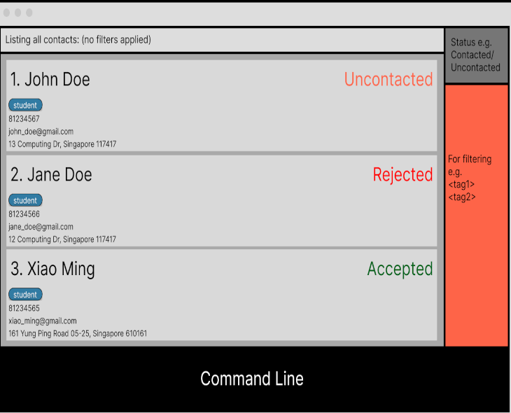
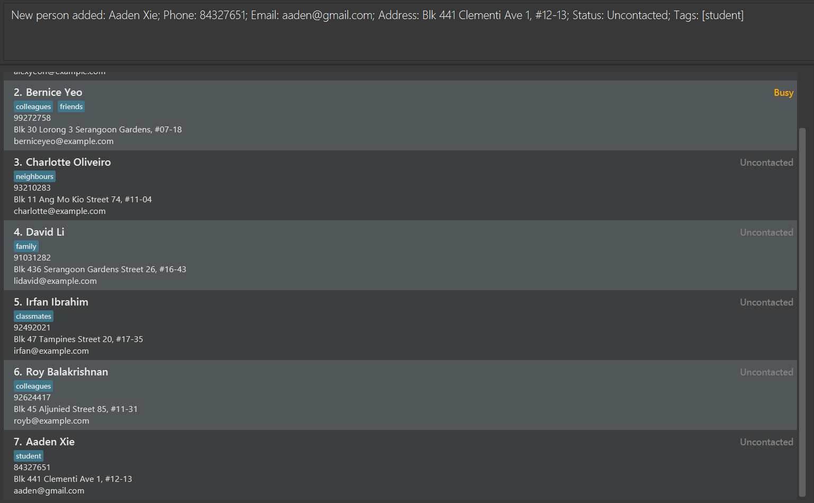
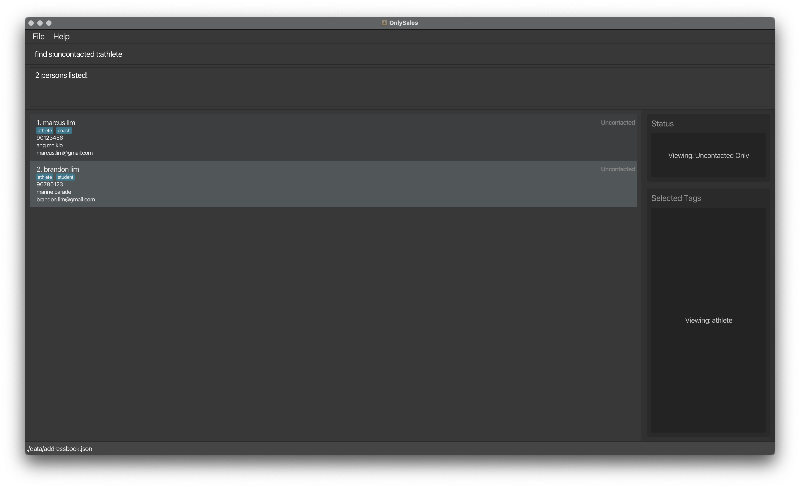
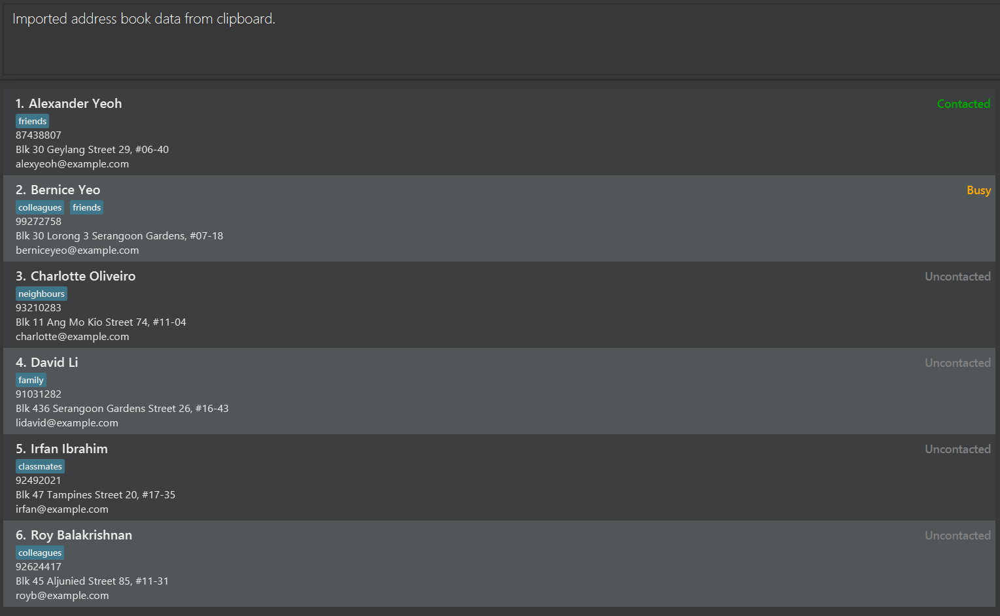

AddressBook Level 3 (AB3) is a **desktop app for managing contacts, optimized for use via a Command Line Interface** (CLI) while still having the benefits of a Graphical User Interface (GUI). If you can type fast, AB3 can get your contact management tasks done faster than traditional GUI apps.

- Table of Contents
{:toc}

---

## Quick start

1. Ensure you have Java `17` or above installed in your Computer. 
   **Mac users:** Ensure you have the precise JDK version prescribed [here](https://se-education.org/guides/tutorials/javaInstallationMac.html).

1. Download the latest `.jar` file from [here](https://github.com/se-edu/addressbook-level3/releases).

1. Copy the file to the folder you want to use as the _home folder_ for your OnlySales.

1. Open a command terminal, `cd` into the folder you put the jar file in, and use the `java -jar addressbook.jar` command to run the application. 
   A GUI similar to the below should appear in a few seconds. Note how the app contains some sample data. 
   

1. Type the command in the command box and press Enter to execute it. e.g. typing **`help`** and pressing Enter will open the help window. 
   Some example commands you can try:

   - `list` : Lists all contacts.

   - `add n:John Doe p:98765432 e:johnd@example.com a:John street, block 123, #01-01` : Adds a contact named `John Doe` to the Address Book.

   - `delete 3` : Deletes the 3rd contact shown in the current list.

   * `delete 1 2 3` : Deletes the 1st, 2nd, and 3rd contacts shown in the current list.
   
   * `template s:Contacted` : Opens the email template editor for contacts with "Contacted" status.

   * `clear` : Deletes all contacts.

   - `exit` : Exits the app.

1. Refer to the [Features](#features) below for details of each command.

---

## Features

**:information_source: Notes about the command format:** 

- Words in `UPPER_CASE` are the parameters to be supplied by the user. 
  e.g. in `add n:NAME`, `NAME` is a parameter which can be used as `add n:John Doe`.

- Items in square brackets are optional. 
  e.g `n:NAME [t:TAG]` can be used as `n:John Doe t:friend` or as `n:John Doe`.

- Items with `…`​ after them can be used multiple times including zero times. 
  e.g. `[t:TAG]…​` can be input as ` ` (i.e. blank string, indicating 0 times), `t:friend`, `t:friend t:family` etc.

- Parameters can be in any order. 
  e.g. if the command specifies `n:NAME p:PHONE_NUMBER`, `p:PHONE_NUMBER n:NAME` is also acceptable.

- Extraneous parameters for commands that do not take in parameters (such as `help`, `list`, `exit` and `clear`) will be ignored. 
  e.g. if the command specifies `help 123`, it will be interpreted as `help`.

- If you are using a PDF version of this document, be careful when copying and pasting commands that span multiple lines as space characters surrounding line-breaks may be omitted when copied over to the application.

### Viewing help : `help`

Shows a message explaining how to access the help page.

**Format:** `help`

### Adding a person: `add`

Adds a person to the address book.

**Format:** `add n:NAME p:PHONE_NUMBER e:EMAIL [a:ADDRESS] [s:STATUS] [t:TAG]…​`

**Parameters:**

- `n:NAME` - The full name of the contact (required, contains letters, numbers, spaces, and symbols such as hyphens, apostrophes, commas, slashes and periods)
- `p:PHONE_NUMBER` - The phone number (required, consists of a single optional `+` at the start and numbers only)
- `e:EMAIL` - The email address (required)
- `a:ADDRESS` - The physical address (optional, max 200 characters)
- `s:STATUS` - The contact status (optional, one of: "Contacted", "Uncontacted", "Busy", "Rejected", "Accepted", "Unreachable"; defaults to "Uncontacted")
- `t:TAG` - Tags for categorization (optional, can have multiple; must contain only alphanumeric characters with no spaces)

:bulb: **Tip:**
A person can have any number of tags (including 0), but only 1 status (default: "Uncontacted")

**Examples:**
* `add n:John Doe p:98765432 e:johnd@example.com`
* `add n:Betsy Crowe t:friend e:betsycrowe@example.com a:Newgate Prison p:1234567 t:criminal s:contacted`

### Listing all persons : `list`

Shows a list of all persons in the address book.

**Format:** `list`

### Changing a person's status: `status`

Sets a person's status in the address book.

**Format:** `status INDEX [STATUS]`

* Changes the status of the person at the specified `INDEX`. The index refers to the index number shown in the displayed person list. The index **must be a positive integer** 1, 2, 3, …​ This field is mandatory.
* Changes the status of the person with the specified `STATUS`. The status of a person can only be "Contacted", "Uncontacted", "Busy", "Rejected", "Accepted" and "Unreachable". If no status is specified, it defaults to "Uncontacted".
* The status input is case-insensitive.

**Examples:**

* `status 12 Contacted`
* `status 12 Rejected`
* `status 12 Accepted`

### Editing a person : `edit`

Edits an existing person in the address book.

**Format:** `edit INDEX [n:NAME] [p:PHONE] [e:EMAIL] [a:ADDRESS] [s:STATUS] [t:TAG]...`

* Edits the person at the specified `INDEX`. The index refers to the index number shown in the displayed person list. The index **must be a positive integer** 1, 2, 3, …​
* At least one of the optional fields must be provided.
* Existing values will be updated to the input values.
* When editing the phone number, it needs to be unique so that the edited contact is not treated as a duplicated person.
* When editing status, the existing status of the person will be removed and replaced with the new one specified.
* When editing tags, the existing tags of the person will be removed i.e adding of tags is not cumulative.
* You can remove all the person’s tags by typing `t:` without specifying any tags after it.

**Examples:**
*  `edit 1 p:91234567 e:johndoe@example.com` Edits the phone number and email address of the 1st person to be `91234567` and `johndoe@example.com` respectively.
*  `edit 2 n:Betsy Crower t:` Edits the name of the 2nd person to be `Betsy Crower` and clears all existing tags.
*  `edit 3 a:557 Bukit Timah Rd, #01-17 Crown Centre, Singapore 269694 s:Busy` Edits the address and status of the 3rd person to be `557 Bukit Timah Rd, #01-17 Crown Centre, Singapore 269694` and `Busy` respectively.

### Locating customers: `find`

Finds customers based on various search criteria including name, tags, status, phone number, or email.

**Format:** `find KEYWORD [MORE_KEYWORDS]` OR `find [n:NAME] [t:TAG]... [s:STATUS] [p:PHONE] [e:EMAIL]`

**Basic Search (by name):**

- The search is case-insensitive. e.g `hans` will match `Hans`
- The order of the keywords does not matter. e.g. `Hans Bo` will match `Bo Hans`
- Only full words will be matched e.g. `Han` will not match `Hans`
- Customers matching at least one keyword will be returned (i.e. `OR` search).
  e.g. `Hans Bo` will return `Hans Gruber`, `Bo Yang`

**Advanced Search (with prefixes):**

- `n:NAME` - Search by name
- `t:TAG` - Search by tag (can specify multiple tags)
- `s:STATUS` - Search by contact status (Uncontacted, Contacted, Rejected, Accepted, Unreachable, Busy)
- `p:PHONE` - Search by phone number
- `e:EMAIL` - Search by email address
- Multiple criteria can be combined for more precise searches
- All searches are case-insensitive
- You can use either prefixes (advanced search) or a basic name-only search.
- Do not mix styles in one command. For example, use `find n:alice t:friend` (advanced) or `find alice` (basic), not `find alice t:friend`.

**Examples:**

**Basic name search:**

- `find John` returns `john` and `John Doe`
- `find alex david` returns `Alex Yeoh`, `David Li`

**Search by name with prefix:**

- `find n:alice` returns all customers with "alice" in their name
- `find n:ali` will NOT return customers with "alice" in their name

**Search by tag:**

- `find t:friends` returns all customers tagged as "friends"
- `find t:colleagues t:VIP` returns customers with either "colleagues" or "VIP" tags

**Search by status:**

- `find s:Contacted` returns all customers with "Contacted" status
- `find s:Rejected` returns all customers with "Rejected" status

**Search by phone:**

- `find p:91234567` returns customers with matching phone number

**Search by email:**

- `find e:gmail.com` returns customers with Gmail addresses
- `find e:john@example.com` returns customers with that specific email

**Combined multi-criteria search:**

- `find n:alice t:friends` returns customers named Alice who are tagged as friends
- `find n:john s:Contacted` returns customers named John with "Contacted" status
- `find t:VIP s:Uncontacted` returns VIP customers who haven't been contacted yet
- `find n:alice t:friends s:Contacted` returns customers named Alice, tagged as friends, and with "Contacted" status

### Tag View and Status View Integration

When dealing with a large number of customers, it is important that salespeople can immediately identify the active filters applied to the customer list.

**Key Features:**

- Tag view displays all currently active tag filters
- Status view displays all currently active status filters
- Both views update automatically when using the `find` command with `t:` or `s:` prefixes

:bulb: **Tip:**
When you use `find t:friends s:Contacted`, the Tag view will highlight "friends" and the Status view will highlight "Contacted", making it easy to see your current filters at a glance.

**Visual Example:**

|         Default View         |                After Find Command with Filters                 |
| :--------------------------: | :------------------------------------------------------------: |
|  |  |
| Before applying find filters |          Tag view and Status view show active filters          |

### Deleting a person : `delete`

Deletes one or more persons from the address book.

**Format:** `delete INDEX [MORE_INDICES]...`

* Deletes the person(s) at the specified `INDEX` (and `MORE_INDICES` if provided).
* The index refers to the index number shown in the displayed person list.
* The index **must be a positive integer** 1, 2, 3, …​
* Multiple indices can be specified to delete multiple persons at once.
* Indices can be provided in any order.
* **All indices must be valid** - if any index is invalid, the command will fail and no persons will be deleted. The error message will show which specific indices are invalid.

**Examples:**
* `list` followed by `delete 2` deletes the 2nd person in the address book.
* `find Betsy` followed by `delete 1` deletes the 1st person in the results of the `find` command.
* `delete 1 3 5` deletes the 1st, 3rd, and 5th persons in the displayed list.
* `delete 4 2 6` deletes the 2nd, 4th, and 6th persons in the displayed list (order doesn't matter).
* `delete 2 99` (when only 2 persons exist) will fail with error message "Invalid index(es) detected: 99" and no deletions will occur.

### Managing email templates :

Manages email templates for different contact statuses. You can open, edit, save, and copy templates to streamline your email communications.

#### Opening a template for editing : `template s:STATUS`

Opens the template editor for a specific contact status.

**Format:** `template s:STATUS`

* Opens the template editor window for the specified `STATUS`.
* `STATUS` must be one of: `Contacted`, `Uncontacted`, `Rejected`, `Accepted`, `Unreachable`, or `Busy`.
* Status is case-insensitive (e.g., `contacted`, `CONTACTED`, `Contacted` all work).
* The template editor allows you to view and edit the email template.
* Changes are not saved automatically - use `template save` to save your changes.

**Examples:**
* `template s:Contacted` opens the template editor for the "Contacted" status.
* `template s:rejected` opens the template editor for the "Rejected" status.
* `template s:BUSY` opens the template editor for the "Busy" status.

#### Saving the current template : `template save`

Saves the currently open template.

**Format:** `template save`

* Saves any changes made to the template currently displayed in the template editor.
* A template must be open (using `template s:STATUS`) before you can save.
* If no template is currently open, an error message will be shown.

**Examples:**
* After opening a template with `template s:Contacted` and making changes, use `template save` to save your edits.

#### Copying a template to clipboard : `template copy s:STATUS`

Copies the content of a template to your clipboard without opening the editor.

**Format:** `template copy s:STATUS`

* Copies the entire template content for the specified `STATUS` to your clipboard.
* `STATUS` must be one of: `Contacted`, `Uncontacted`, `Rejected`, `Accepted`, `Unreachable`, or `Busy`.
* Status is case-insensitive.
* The template is copied as-is from storage - you can then paste it into your email client.
* Does not open the template editor.

**Examples:**
* `template copy s:Contacted` copies the "Contacted" template to your clipboard.
* `template copy s:unreachable` copies the "Unreachable" template to your clipboard.

:bulb: **Tip:**
Use `template copy` for quick access to templates when you need to send emails, and use `template s:STATUS` followed by `template save` when you need to update your templates.

:information_source: **Note:**
Templates are stored as text files in the `templates` folder in your application directory. Each status has its own template file.

### Import contacts: `import`

Imports an address book from the clipboard and replaces the current address book.

**Format:** `import`

* The address book data should be copied to your clipboard before running this command.
* Alternatively, press `F7` to open the import preview window where you can review the contacts before importing.
* The import will validate the JSON format and ensure all contacts meet the required field constraints.

:exclamation: **Warning:**
Import replaces your entire address book when data is valid. Make sure to export your current contacts first if you want to keep them.

**Common error messages:**

* "Clipboard does not contain any text to import" - The clipboard is empty. Copy the address book JSON data first.
* "Failed to import: Clipboard does not contain valid address book JSON." - The clipboard content is not valid JSON or doesn't match the expected address book format.

**Examples:**
* Copy address book JSON data to clipboard, then run `import` to import all contacts.
* Press `F7` to open the import preview window and review contacts before importing.

### Clearing all entries : `clear`

Clears all entries from the address book.

**Format:** `clear`

### Exiting the program : `exit`

Exits the program.

**Format:** `exit`

### Saving the data

AddressBook data are saved in the hard disk automatically after any command that changes the data. There is no need to save manually.

### Editing the data file

AddressBook data are saved automatically as a JSON file `[JAR file location]/data/addressbook.json`. Advanced users are welcome to update data directly by editing that data file.

:exclamation: **Caution:**
If your changes to the data file makes its format invalid, AddressBook will discard all data and start with an empty data file at the next run. Hence, it is recommended to take a backup of the file before editing it. 
Furthermore, certain edits can cause the AddressBook to behave in unexpected ways (e.g., if a value entered is outside of the acceptable range). Therefore, edit the data file only if you are confident that you can update it correctly.

### Archiving data files `[coming in v2.0]`

_Details coming soon ..._

---

## FAQ

**Q**: How do I transfer my data to another Computer? 
**A**: Install the app in the other computer and overwrite the empty data file it creates with the file that contains the data of your previous AddressBook home folder. Alternatively, you can use the import and export commands.

---

## Known issues

1. **When using multiple screens**, if you move the application to a secondary screen, and later switch to using only the primary screen, the GUI will open off-screen. The remedy is to delete the `preferences.json` file created by the application before running. Alternatively, you can use the `import` and `export` commands.
2. **If you minimise the Help Window or Import Preview Window**, attempting to open them again (using `help` command, `F1`, or `F7`) will not create a new window. The remedy is to manually restore the minimised window.

---

## Command summary

Action | Format, Examples
--------|------------------
**Add** | `add n:NAME p:PHONE_NUMBER e:EMAIL a:ADDRESS [t:TAG]…​`   e.g., `add n:James Ho p:22224444 e:jamesho@example.com a:123, Clementi Rd, 1234665 t:friend t:colleague`
**Clear** | `clear`
**Delete** | `delete INDEX [MORE_INDICES]...`  e.g., `delete 3` or `delete 1 2 3`
**Edit** | `edit INDEX [n:NAME] [p:PHONE_NUMBER] [e:EMAIL] [a:ADDRESS] [t:TAG]…​`  e.g.,`edit 2 n:James Lee e:jameslee@example.com`
**Status** | `status INDEX [STATUS]`  e.g. `status 4 busy`
**Find** | `find KEYWORD [MORE_KEYWORDS]` OR `find [n:NAME] [t:TAG]... [s:STATUS] [p:PHONE] [e:EMAIL]`  e.g., `find John`, `find n:alice t:friends s:Contacted`
**List** | `list`
**Help** | `help`
**Template (Open)** | `template s:STATUS`  e.g., `template s:Contacted`
**Template (Save)** | `template save`
**Template (Copy)** | `template copy s:STATUS`  e.g., `template copy s:Rejected`
**Import Contacts** | `import`
**Export Contacts** | `export`
